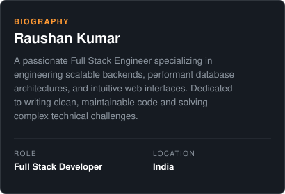
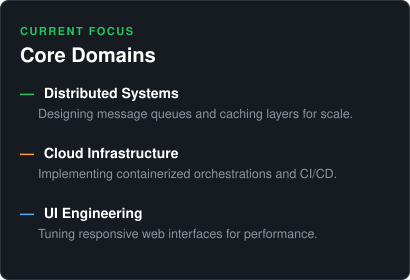
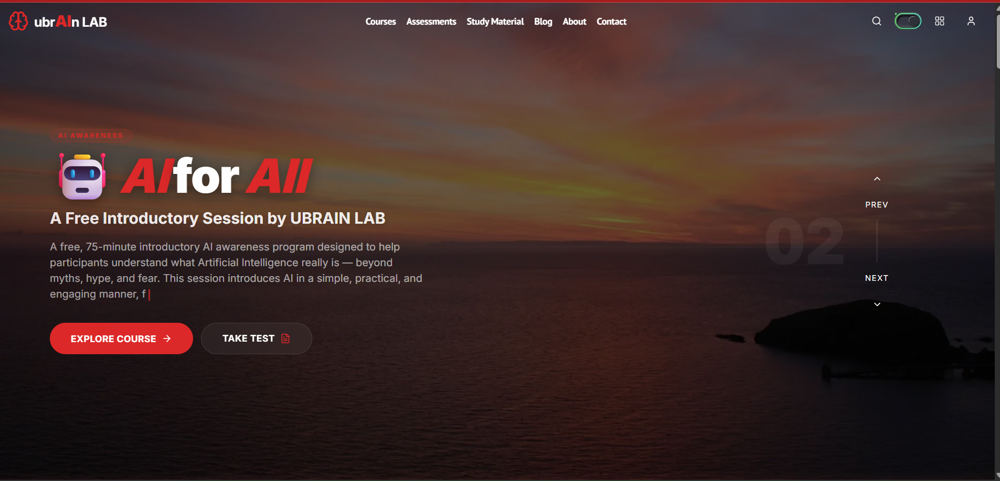
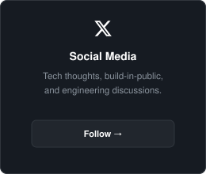

<!-- Header Card -->
<table align="center" width="100%" style="border-collapse: collapse; border: none; margin-bottom: 20px;">
  <tr style="border: none;">
    <td style="border: none; background: #161b22; border-radius: 12px; padding: 25px 25px 15px 25px; text-align: center;">
      
      

        
        
        
      

    </td>
  </tr>
</table>

<h3 style="color: #00f2fe; background: rgba(0, 242, 254, 0.08); border: 1px solid rgba(0, 242, 254, 0.25); padding: 8px 24px; border-radius: 30px; font-family: -apple-system, BlinkMacSystemFont, 'Segoe UI', Roboto, sans-serif; font-size: 18px; font-weight: 700; font-style: italic; display: inline-block; margin-top: 10px; margin-bottom: 20px;">GitHub Analytics</h3>

<!-- GitHub Stats & Streak Cards -->
<table align="center" style="border-collapse: collapse; border: none;">
  <tr style="border: none;">
    <td style="border: none; padding: 0 8px;">
      
    </td>
    <td style="border: none; padding: 0 8px;">
      
    </td>
  </tr>
</table>

<!-- Activity Graph -->

  

  <h3 style="color: #ff9933; background: rgba(255, 153, 51, 0.08); border: 1px solid rgba(255, 153, 51, 0.25); padding: 8px 24px; border-radius: 30px; font-family: -apple-system, BlinkMacSystemFont, 'Segoe UI', Roboto, sans-serif; font-size: 18px; font-weight: 700; font-style: italic; display: inline-block; margin-top: 10px; margin-bottom: 20px;">About Me</h3>

  
  

  <h3 style="color: #ffffff; background: rgba(255, 255, 255, 0.05); border: 1px solid rgba(255, 255, 255, 0.15); padding: 8px 24px; border-radius: 30px; font-family: -apple-system, BlinkMacSystemFont, 'Segoe UI', Roboto, sans-serif; font-size: 18px; font-weight: 700; font-style: italic; display: inline-block; margin-top: 10px; margin-bottom: 20px;">Ecosystem &amp; Arsenal</h3>

<table align="center" style="border-collapse: collapse; border: none; font-family: -apple-system, BlinkMacSystemFont, 'Segoe UI', Roboto, sans-serif; width: 100%;">
  <tr style="border: none;">
    <td align="left" style="border: none; padding: 12px 0;">
      
Frontend

      

        
        
        
        
        
        
        
        
      

    </td>
  </tr>
  <tr style="border: none;">
    <td align="left" style="border: none; padding: 12px 0;">
      
Backend

      

        
        
        
      

    </td>
  </tr>
  <tr style="border: none;">
    <td align="left" style="border: none; padding: 12px 0;">
      
Database

      

        
        
        
      

    </td>
  </tr>
  <tr style="border: none;">
    <td align="left" style="border: none; padding: 12px 0;">
      
Cloud &amp; DevOps

      

        
        
        
        
      

    </td>
  </tr>
</table>

  <h3 style="color: #22c55e; background: rgba(34, 197, 94, 0.08); border: 1px solid rgba(34, 197, 94, 0.25); padding: 8px 24px; border-radius: 30px; font-family: -apple-system, BlinkMacSystemFont, 'Segoe UI', Roboto, sans-serif; font-size: 18px; font-weight: 700; font-style: italic; display: inline-block; margin-top: 10px; margin-bottom: 20px;">Featured Projects</h3>

### **UbrainLab**

  

  
  
  
  
  
  
  

  A free, 75-minute introductory AI awareness program designed to help participants understand what Artificial Intelligence really is — beyond myths, hype, and fear. Features interactive assessments and course materials.

  <a href="https://ubrainlab.com" target="_blank" style="display: inline-block; background: #238636; border: 1px solid #2ea44f; padding: 6px 16px; border-radius: 6px; color: #ffffff; font-size: 12px; text-decoration: none; font-weight: 600;">Live Demo</a>

---

### **Urekha Astro**

  

  
  
  
  
  
  
  

  A personalized astrological intelligence platform for Vedic Astrology. Synthesizes natal charts, planetary transits, and predictive karmic timelines using high-fidelity neural network engines.

  <a href="https://astro.urekha.com" target="_blank" style="display: inline-block; background: #238636; border: 1px solid #2ea44f; padding: 6px 16px; border-radius: 6px; color: #ffffff; font-size: 12px; text-decoration: none; font-weight: 600;">Live Demo</a>

  <h3 id="lets-connect" style="color: #ff9933; background: rgba(255, 153, 51, 0.08); border: 1px solid rgba(255, 153, 51, 0.25); padding: 8px 24px; border-radius: 30px; font-family: -apple-system, BlinkMacSystemFont, 'Segoe UI', Roboto, sans-serif; font-size: 18px; font-weight: 700; font-style: italic; display: inline-block; margin-top: 10px; margin-bottom: 20px;">Let's Connect</h3>

  
  
  

